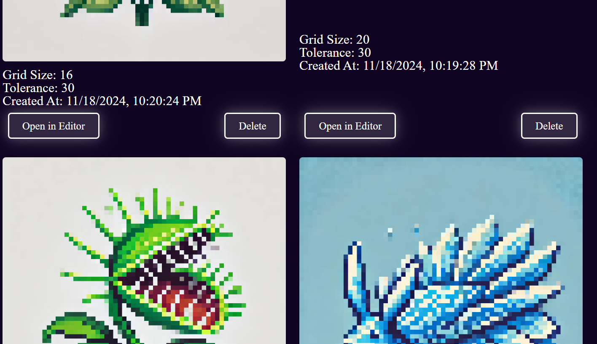

# Pixel Grid Snapper
A full-stack web app for fixing and editing pixel art using Node.js, Express, SQLite, and EJS. Users upload imperfect pixel art, adjust grid size and color tolerance, and download the optimized image. Saved projects, including original and snapped images with metadata, are managed through a gallery interface.

The app uses run-length encoding and variance analysis to estimate the intended pixel block size and location by analyzing sequences of similar colors. It selects the grid with the least variance and evaluates its accuracy by comparing color differences between estimated cells and the original image.

Currently, users can upload, edit, and save projects to an SQLite database, view them in a gallery with thumbnails and metadata, and delete projects. Future updates will include user authentication, cloud-based data hosting, enhanced snapping algorithms, and collaborative features like sharing and voting.

To run locally, clone the repository, install dependencies using `npm install`, and start the server using `node server.js`. Access the app at `http://localhost:3000`.

CRUD OPERATIONS:
For the full list of current crud operations, open server.js

For "imperfect" pixel art samples to test the app on, navigate to public\img

